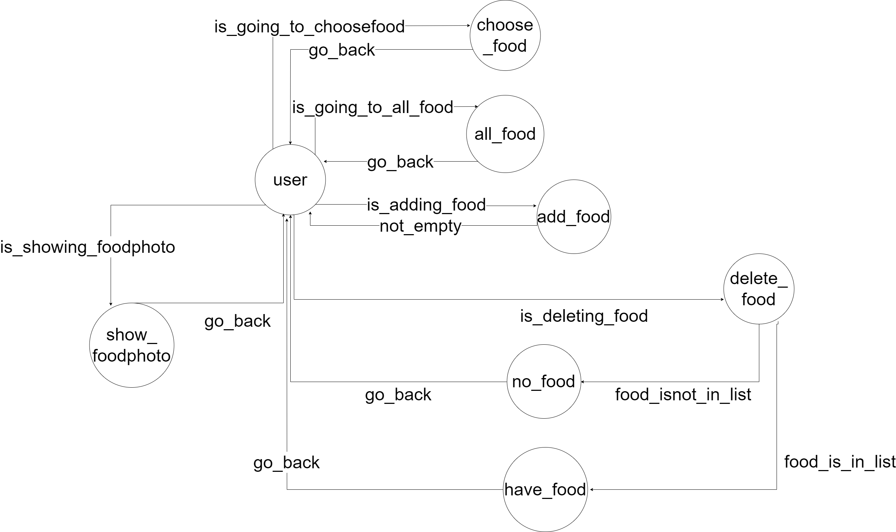

# TOC Project 2020

	我這次所做的聊天機器人主題是：下一餐吃什麼？我會坐這個機器人的主要原因是，每天都會有一樣的問題困擾我，那就是午(晚)餐要吃什麼，所以既然自己無法決定就讓機器人幫我決定吧！

## Finite State Machine

## Usage
The initial state is set to `user`.

首先我使用一個state名為choose_food，來用random決定食物，當然使用者會想要看看清單裡面有沒有討厭的食物，因此all_food的state可以看到清單內有那些食物，再來預設的食物可能沒有自己喜歡的食物，所以我還有設立了add_food和delete_food讓使用者可以自行增加及刪除食物，客製化自己的食物清單，其中delete_food由於要判斷刪除的食物是否在list中，所以要透過have_food和no_food兩個state來判斷，最後如果覺得抽食物只看文字太單調，我還有設立了show_foodphoto這個state來讓使用者抽食物照片，看到美食也會讓使用者更有胃口吧！